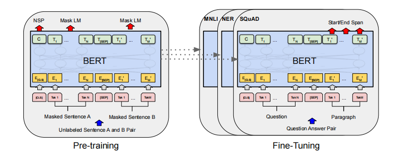
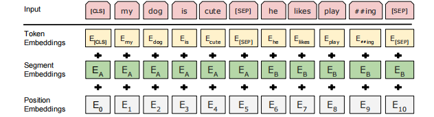
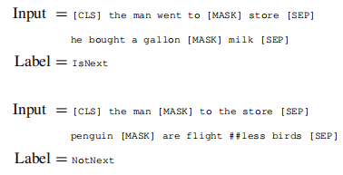

# 《文本分类论文阅读和项目说明》

---

本文作者：Horevl

申明：本文仅代表个人观点，如有建议或意见，请联系xj806411orevl@gmail.com。

---

## 1. BERT: Pre-training of Deep Bidirectional Transformers for Language Understanding

我选用了BERT（Bidirectional Encoder Representations from Transformers）作为项目的encoder。

---

### 1.1 BERT介绍

BERT是一个预训练的模型，它通过无标签的数据进行训练（后面会说明）。一般来说这种模型在小数据集上面可以不用接着训练，但是在大的数据集上面还是需要接着训练的，具体情况可以根据下游任务和数据集的大小决定。 

在BERT的原文中，作者说明他的BERT再加上一个额外的输出层就可以实现比较好的结果。这是区别于**ELMo**的地方，因为ELMo使用的RNN的架构，要根据下游任务进行调整，对每种类型训练不同的神经网络。相比而言，BERT只要改最上层就可以了。

BERT和**GPT**的不同在于BERT是通过右侧和左侧的信息实现，而GPT仅用左边的信息来预测未来。

两种预训练进行下游任务的方法：**feature-based**（特征表示）和**fine-tuning**（微调）。

BERT主要用的的方法：

- **MLM**（masked language model）：这个模型的机理类似于完形填空，即通过掩码随机遮住部分次元。
- **next sentence prediction**：随机采样两个句子，来判断两个句子在原文中是否相邻。

---

### 1.2 BERT的使用流程



**pre-training**阶段：模型在<u>**大量的无标注数据**</u>使用**1.1**提到的方法进行训练。

**fine-tuning**阶段：模型使用pre-training的权重，然后通过有标注的数据对模型进行微调。

---

### 1.3 BERT的结构

BERT使用的是L个H大小的transformer block。

---

#### 1.3.1 嵌入层

一个矩阵，输入是字典的大小，输出是隐藏层的大小H。具体来说是Token Embeddings、Segment Embeddings和Position Embeddings的加和。

---

#### 1.3.2 transformer block

每个transformer block由自注意力模块和MLP组成。

自注意力机制本没有参数，但是多头注意力会对每个头的K、V、Q进行投影，投影成$H\times64$的矩阵，共有$A=H\div64$个头。

两个MLP层分别是输入H、输出4H和输入4H、输出H。

---

#### 1.3.3 输入和输出

输入可以是一个序列（一个句子或者一对句子）。

原文用的是**WordPiece embeddings**的方法。核心思想是如果一个词在整个文本中出现的概率不大，我们应该将它切开，去看它的子序列。如果它的某个子序列是个词根，且出现概率比较高，那就只保留这个子序列。

每个序列的第一个词都是**[CLS]**，在每个句子后面放一个**[SEP]**和embedding来区分句子，具体如**下图**所示。



---

#### 1.3.4 pre-training不同的部分

**Mask LM**：如果有一个词元是WordPiece生成的，那它有15%的概率进行下面的处理。80%的被替换成**[MASK]**，10%替换成随机词元，10%不变。

---

**Next Sentence Prediction**：



---

#### 1.3.5 fine-tuning不同的部分

根据下游任务设计输入和输出。

**分类**：设计softmax，输出类别。

**Q&A**：设计两个向量S和E，用来表示答案开始的概率和答案结束的概率，具体计算公式如下：
$$
P_i=\frac{e^{S\cdot T_i}}{\sum_j{e^{S\cdot T_j}}}
$$

---

### 1.4 本项目和原文的区别

在本项目中，和原文中的BERT模型的区别如下：

- 本项目采用的是单语句识别，仅有[CLS]和一个[SEQ]，所有的segment都是0.
- 训练时不包含NSP。
- 没有Task Head，仅输出embedding。

---

## 2. Contrastive and Generative Graph Convolutional Networks for Graph-based Semi-Supervised Learning

组里的算法，暂时没看。项目中这一部分全部由ChatGPT-4o生成。

---

## 3. Learning with Local and Global Consistency

标签传播算法是一种半监督的算法。

文中作者认为半监督学习的关键问题在于一致性的前提假设。一致性包含以下两个方面：

- 节点越是接近，标签相同的可能性越大。
- 处于相似结构（聚类或者流行结构）的节点，标签的可能性越大。

基于上述假设，设置若干种子节点，依照某种规则取传播他们的标签，当算法收敛的时候，就能得到所有节点的标签类别。

---

## 4. Manifold Regularization Classification Model Based On Improve Diffusion Map

### 4.1 Diffusion Map的计算

#### 4.1.1 PCA（主成分分析）和Diffusion Map的区别

PCA是线性最佳投影，有的时候不能区分样本的特征。

Diffusion Map是非线性的变化，通过扩散进行。

---

#### 4.1.2 计算Distance Matrix

一般计算欧式距离。
$$
dist(x,y)=\sum_{i=1}^{n}(x_{i}-y_{i})^{2}
$$
也可以用其它距离函数。

---

#### 4.1.3 通过Kernel计算Affinity Matrix

Kernel函数的定义如下：
$$
k(x,y)=k(y,x)\\
k(x,y)\geq0
$$
Gaussian Kernel：
$$
k(x,y)=exp(-\frac{\|x-y\|^2}{2\sigma^2})
$$
编程中使用rbt来选用，但是要事先确定$\sigma$。

Adaptive Gaussian Kernel：
$$
k(x,y)=\frac{1}{2}\times (exp(-\frac{\|x-y\|^2}{2\sigma_k(x)^2})+exp(-\frac{\|x-y\|^2}{2\sigma_k(y)^2}))
$$
其中，$\sigma_k(x)$是到$x$最近的第$k$个点的距离。

通过4.1.2计算出的$D_{ij}$计算出$A_{ij}$：
$$
A_{ij}=k(D_{ij})
$$

---

#### 4.1.4 通过行和计算Markov Matrix

就是Affinity Matrix进行行归一化：
$$
M_{ij}=A_{ij}\div(\sum_{i=1}^{n}{A_{ij}})
$$
将所求的MarKox Matrix通过以下公式进行分解：
$$
M=\Phi\Lambda\Psi\\
M^t=\Phi\Lambda^t\Psi
$$
其中，$\Lambda$是特征值（Eigenvalue），$\Phi$和$\Psi$是左特征向量和右特征向量（Eigenvector）。

在$M_t$倍乘的时候，Eigenvalue会发生变化，而Eigenvector不会发生变化。

但在实际计算的过程中，通常采用计算Degree Matrix来方便计算（$D$是每一行的和算出来后，排列成一个对角矩阵）：
$$
M=D^{-1}\times A\\
Symmetric:M_s=D^{-\frac{1}{2}}AD^{-\frac{1}{2}}
$$

---

#### 4.1.5 计算Diffusion Map

特征值有以下特点：
$$
1=\lambda_1\geq\lambda_2\geq...\geq\lambda_n\geq0
$$
新点坐标（coordinate）计算公式：
$$
\Psi_t(x)=(\lambda_2^t\psi_2(x),\lambda_3^t\psi_3(x),...,\lambda_n^t\psi_n(x))
$$
数据由n维变成n-1维。

Diffusion Mapping：
$$
Mapping=\Lambda^t\Psi
$$
正常只取前k个坐标。

---

#### 4.1.6 评价指标

- left most eigenvector：扩散过程中的稳定态：$\lim_{t\rightarrow\infty}{p(t,y|x)=\phi_0(y)}$,也反应数据密集程度.
- diffusion distance:计算新坐标下的距离，用欧式空间的距离表示diffusion distance

---

### 4.2 Manifold Regularization Model

#### 暂时没看

---

## 5. 项目说明

### 5.1 项目结构

---

### 5.2 项目参数说明

本项目使用统一的配置文件管理系统，通过 JSON 文件集中配置训练、图构建、BERT 编码和推理模块的相关参数。参数说明如下：

---

#### 5.2.1 数据与模型配置

| 参数名                | 类型   | 说明                                                  |
| --------------------- | ------ | ----------------------------------------------------- |
| `dataset_path`        | string | 输入数据集路径（CSV 格式，含 `text` 和 `label` 字段） |
| `dataset_format`      | string | 数据格式标识，如 `"csv"`                              |
| `language`            | string | 数据语言，如 `"en"`、`"zh"`，用于选择相应 tokenizer   |
| `bert_model`          | string | HuggingFace 预训练模型名，如 `"bert-base-uncased"`    |
| `embedding_save_path` | string | 嵌入向量保存目录，用于后续图建图和模型训练            |
| `output_path`         | string | 结果输出路径（含分类结果）                            |

---

#### 5.2.2 通用训练参数

| 参数名       | 类型   | 说明                                                   |
| ------------ | ------ | ------------------------------------------------------ |
| `batch_size` | int    | BERT 编码的批处理大小，控制显存占用与并行效率          |
| `device`     | string | 设备设置，如 `"cuda"` 或 `"cpu"`，用于控制模型运行位置 |

---

#### 5.2.3 CG3 模块参数（对比与生成图卷积网络）

| 参数名          | 类型  | 说明                                                     |
| --------------- | ----- | -------------------------------------------------------- |
| `cg3_epochs`    | int   | CG3 模块训练轮数                                         |
| `cg3_lr`        | float | 学习率                                                   |
| `cg3_k`         | int   | KNN 图中每个节点的邻居数量                               |
| `cg3_sigma`     | float | 高斯核函数带宽 $\sigma$，控制相似度权重衰减              |
| `cg3_threshold` | float | CG3 中伪标签选择阈值（置信度大于此值才被利用）           |
| `cg3_warmup`    | int   | warm-up 阶段轮数，仅使用标注样本训练，避免初期伪标签干扰 |

---

#### 5.2.4 流形分类器参数（Manifold Classifier）

| 参数名                | 类型  | 说明                                           |
| --------------------- | ----- | ---------------------------------------------- |
| `manifold_k`          | int   | Diffusion Map 降维后图的 KNN 邻居数            |
| `manifold_epochs`     | int   | 分类器训练轮数                                 |
| `manifold_lr`         | float | 学习率                                         |
| `manifold_sigma`      | float | 相似度图中的核函数参数                         |
| `manifold_components` | int   | Diffusion Map 的降维维度                       |
| `manifold_landmarks`  | int   | 用于 landmark-based Diffusion Map 加速的锚点数 |

---

#### 5.2.5 标签传播参数（LLGC）

| 参数名       | 类型  | 说明                                                         |
| ------------ | ----- | ------------------------------------------------------------ |
| `llgc_alpha` | float | 标签传播时的衰减系数 $\alpha$，控制传播程度（常取接近 1 的值） |

---

### 5.3 使用案例

英文案例

```python train.py --config configs/config_en.json```

中文案例

```python train.py --config configs/config_zh.json```

### 5.4 测试案例

英文测试

```python acc_en.py --config configs/config_en.json```

中文测试

```python acc_zh.py --config configs/config_zh.json```
